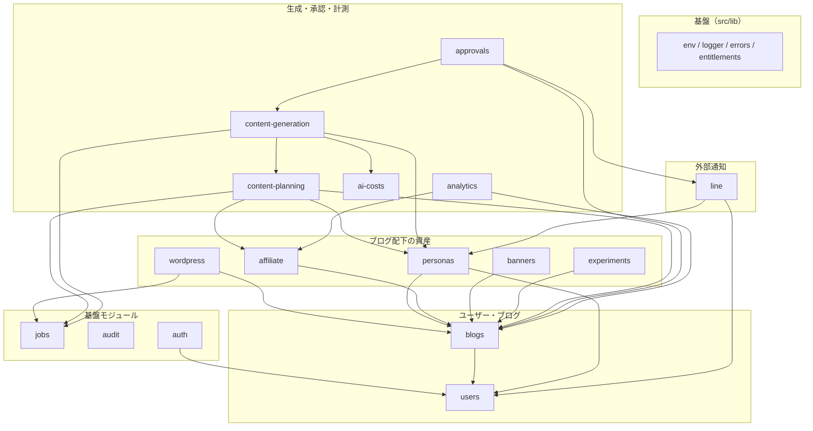

# MODULE RULES

モジュール境界のルール（TASKS A-4）。対象は `src/modules/` 配下の全モジュール。

`src/lib/` は全モジュールが依存してよい共通基盤であり、本ルールの「モジュール」には含めない。`src/lib/` から `src/modules/` を import してはならない。

---

## 1. 他モジュールのテーブルに直接アクセスしない

モジュールは、自分が所有するテーブル以外を直接読み書きしない。必ず対象モジュールが公開する関数を経由する。

```ts
// してはならない：他モジュールのテーブルを直接引く
const blog = await prisma.blog.findUnique({ where: { id: blogId } });

// 正しい：所有モジュールの公開関数を経由する
import { requireBlogForUser } from '@/modules/blogs';
const blog = await requireBlogForUser({ blogId, userId });
```

**所有権検証のヘルパーは B-3 で `src/modules/blogs/ownership.ts` に実装した。**
ブログ配下の資源を扱うモジュール（`wordpress` `affiliate` `banners` `personas`
`content-planning` など）は、自分のテーブルを触る前に `requireBlogForUser` を通す。

| 関数 | 用途 |
|---|---|
| `requireBlogForUser({ userId, blogId })` | 自分のブログを取る。無ければ404 |
| `ownedBy({ userId, id })` | `where` 条件を作る。手で組み立てない |
| `requireFound(value)` | `null` を404に変換する |

**所有していない資源は 403 ではなく 404 を返す。** 403 だと「そのIDは存在するが
他人のものだ」と伝わり、IDの総当たりで他ユーザーの資源の有無を調べられる。

**理由。** テナント越境（SPEC 14.1）を防ぐ所有権検証は B-3 で共通ヘルパーとして実装し、以降の全モジュールで使い回すと決まっている。各モジュールが直接テーブルを引くと、この検証を通らない経路が生まれる。`WHERE id = :id AND user_id = :sessionUserId` を各所で書かせないためのルールでもある。

### テーブルの所有

| モジュール | 所有テーブル |
|---|---|
| `users` | `users` `monitor_profiles` |
| `blogs` | `blogs` `genres` |
| `wordpress` | `wordpress_connections` `wordpress_posts` |
| `personas` | `user_personas` `blog_persona_settings` `persona_facts` |
| `affiliate` | `affiliate_offers` `affiliate_links` |
| `banners` | `banners` |
| `experiments` | `experiment_groups` |
| `content-planning` | `content_plans` `content_items` `planning_runs` |
| `content-generation` | `article_versions` `prompt_versions` |
| `approvals` | `approvals` `revision_requests` |
| `analytics` | `metrics_daily` `link_clicks` `search_console_connections` |
| `ai-costs` | `ai_usage_logs` |
| `jobs` | `jobs` |
| `audit` | `audit_logs` |
| `auth` | なし（`users` は `users` モジュール経由で参照する） |
| `line` | なし（外部APIとの入出力のみ） |

テーブル名は `docs/DATA_MODEL.md` と `prisma/schema.prisma` に従う（A-2 時点の26テーブル全てに所有モジュールを割り当てている）。所有の割り当てを変える場合は、本ファイルを同じPRで更新する。

---

## 2. `index.ts` を唯一の入口とする

各モジュールは `src/modules/<name>/index.ts` を公開インターフェースとし、そこから export されていない関数・型・定数を外部から呼ばない。

```ts
// してはならない：内部ファイルを直接参照する
import { verifyIdToken } from '@/modules/auth/liff/verify-id-token';

// 正しい：入口から取る
import { verifyIdToken } from '@/modules/auth';
```

`index.ts` は再export に徹し、ロジックを持たせない。何を公開しているかが1ファイルで読めることに意味がある。

内部実装は `src/modules/<name>/` 配下で自由に分割してよい。同一モジュール内では相対パスで参照する。

---

## 3. 依存は一方向に保ち、循環参照を禁止する

モジュール間の依存に循環を作らない。A が B を import しているなら、B は直接にも間接にも A を import しない。

循環しそうな場合は、次のいずれかで解消する。

- **ジョブを挟む。** 呼び出し方向を逆にしたい処理はジョブとしてキューに載せる（SPEC 4.3）
- **上位へ寄せる。** どちらにも属さない処理は呼び出し元（`src/app/`）へ持ち上げる
- **所有を見直す。** 双方向に必要なデータは、そもそも所有モジュールが誤っている可能性がある

---

## 現時点で想定している依存の向き

矢印は「**import する側 → される側**」。`auth --> users` は「`auth` が `users` を import する」という意味であり、逆向きに読まない。



箇条書きでの同じ内容。

- **`src/lib`** — 誰にも依存しない。全モジュールが依存してよい
- **`jobs`** — ドメインモジュールを import しない。ジョブハンドラの登録は `src/app/` 側で行う。これを守らないと `jobs → wordpress → jobs` の循環になる
- **`audit`** — 誰にも依存しない。全モジュールから呼ばれる
- **`users`** — `src/lib` のみ。`users` テーブルを所有し、他モジュールへ `AppUser` として渡す
- **`auth`** — `users`。IDトークンを検証し、`line_user_id` から内部ユーザーを解決してセッションを発行する（B-1・B-2）
- **`blogs`** — `users`
- **`wordpress` `personas` `affiliate` `banners` `experiments`** — `blogs`（＋ `wordpress` は `jobs`、`personas` は `users` も）
- **`content-planning`** — `blogs` `affiliate` `personas` `jobs`
- **`content-generation`** — `content-planning` `personas` `ai-costs` `jobs`
- **`approvals`** — `content-generation` `blogs` `line`
- **`analytics`** — `blogs` `affiliate`
- **`ai-costs`** — `src/lib` のみ。呼ばれる側に徹する
- **`line`** — 送信は `approvals` から呼ばれる。受信（LINE返信）は `users` `personas` を呼ぶ

### `approvals` と `line` の向き

送信方向は `approvals → line` に固定する（F-2）。

受信方向は `line → approvals` にすると循環するため、**LINE Webhook はジョブに載せる**（D-7・F-6）。`line` はリクエストを受けてジョブを積むところまでを担い、承認処理そのものは `src/app/` に登録したジョブハンドラが `approvals` を呼ぶ。

---

## 適用

- 本ルールは A-4 時点の想定であり、モジュールの実装が進むにつれて依存が増える。**依存を追加するタスクは、本ファイルの図と箇条書きを同じPRで更新する**
- ルールに反する必要が生じた場合は、実装せず `docs/OPEN_QUESTIONS.md` へ記録する
- 循環参照の自動検出は導入していない。CI へ組み込む場合は A-5 で扱う
